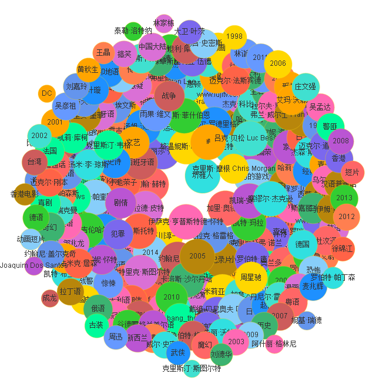

# doubanuserinfo2chart

一个初学者的玩具，学习使用BeautifulSoup.py和echarts。
根据豆瓣用户的id，分析该用户的信息，输出图表。
目前能够输出的结果：[例子](http://knarfeh.github.io/htmlfile/52269090.html)

## TODO
 * 提取更多信息
 * 加强排版
 * 需要解决标签过多或标签过少的情况，如：
  
  
   ·